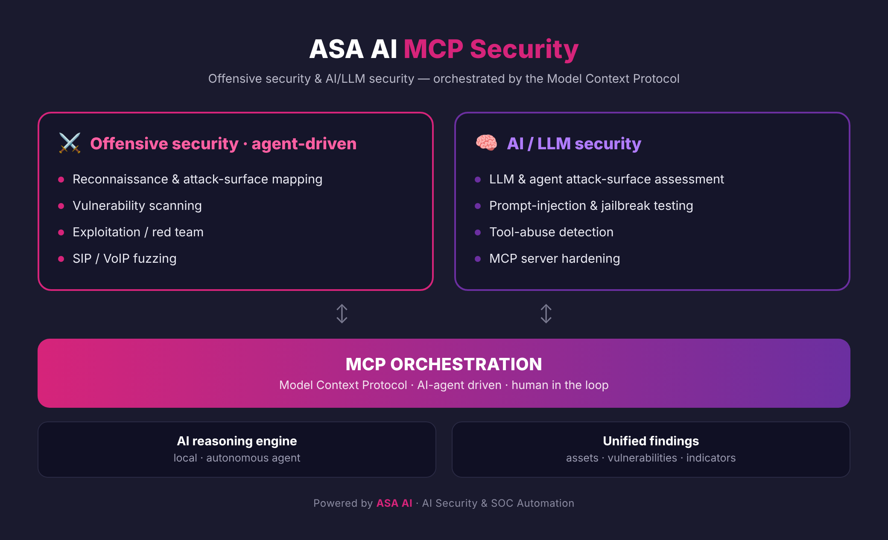


<a href="README.md">🌐 English</a> · <b>Français</b> · <a href="README.es.md">Español</a>

# 🔐 ASA-AI MCP Security

### Sécurité offensive & sécurité IA/LLM — orchestrées par le Model Context Protocol

**Mettez un agent IA à l'offensive — et verrouillez l'IA elle-même.**

---

## Le MCP connecte votre IA à tout. C'est le risque — et l'opportunité.

Le **Model Context Protocol (MCP)** relie les agents IA aux outils et aux données. Il décuple l'automatisation — et ouvre une nouvelle surface d'attaque : outils sur-privilégiés, prompt injection via les sorties d'outils, serveurs MCP non fiables.

**ASA-AI MCP Security** transforme ce protocole en avantage : un **agent IA qui mène la sécurité offensive**, et une couche qui **sécurise l'IA elle-même**.

## Deux piliers, un orchestrateur IA

### ⚔️ Sécurité offensive — pilotée par agent
- Reconnaissance & cartographie de la surface d'attaque
- Analyse de vulnérabilités
- Exploitation / red team
- Fuzzing SIP / VoIP

### 🧠 Sécurité IA / LLM
- Évaluation de la surface d'attaque des LLM & agents
- Tests de prompt-injection & jailbreak
- Détection d'abus d'outils
- Durcissement des serveurs MCP

> Orchestré par MCP, piloté par un agent IA autonome, avec un **humain dans la boucle**.

## Pourquoi c'est important

- **Tests offensifs à la vitesse machine** — l'agent enchaîne reconnaissance, scan et exploitation.
- **La couche IA elle-même est sécurisée** — agents et serveurs MCP, pas seulement le réseau.
- **La validation humaine reste dans la boucle** — pas d'automatisation aveugle.

---

## 🚀 Demandez une démonstration

### 📩 **contact@asa-ai.fr** · 🌐 **[asa-ai.fr](https://www.asa-ai.fr)**

---

## À propos d'ASA AI

**ASA AI** conçoit des solutions de **sécurité VoIP** et d'**automatisation du SOC** pilotées par l'IA.

🌐 [asa-ai.fr](https://www.asa-ai.fr) · 📩 [contact@asa-ai.fr](mailto:contact@asa-ai.fr) · 💼 [LinkedIn](https://www.linkedin.com/in/asa-ai-101815430/)

© ASA AI · Sécurité IA & Automatisation du SOC · Île-de-France, France
